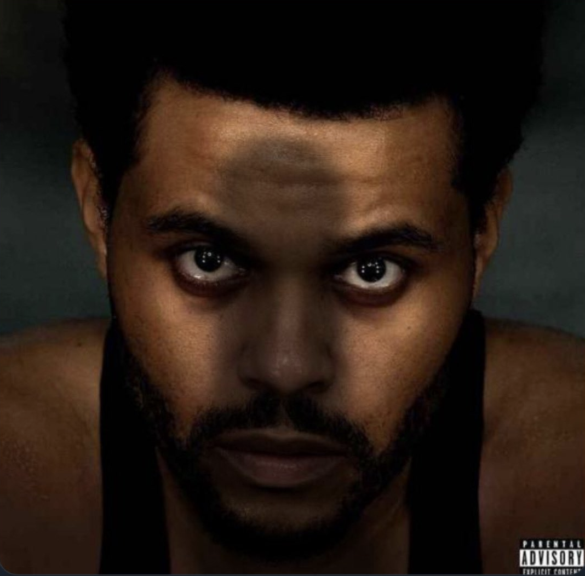

Mykyta Dymchenko, n01624422

This project is an Android application that demonstrates fundamental Android development concepts, including fragments, navigation, data passing, UI updates, and localization.

[https://github.com/MykytaDymchenko01624/MykytaDymchenkoLab7](https://github.com/MykytaDymchenko01624/MykytaDymchenkoLab7)

## Project Overview

This Android application, named "MykytaLab7," is designed to showcase various core Android development principles. It features multiple fragments, each serving a distinct purpose, and demonstrates how to navigate between them using both a Bottom Navigation View and an upper menu. The app also illustrates how to pass data between fragments, dynamically update the UI, and handle localization for different languages.

## Features

*   **Multiple Fragments:** The app is structured with several fragments, including:
    *   **HomeFragment:** A basic fragment with a progress bar and an image button.
    *   **JohnFragment:** A fragment with radio buttons and an alert dialog.
    *   **PersonFragment:** A fragment displaying a list of Canadian provinces and territories, allowing single selection.
    *   **SettingsFragment:** A fragment that displays a continuously updating clock, the selected province, and its index.
*   **Navigation:**
    *   **Bottom Navigation View:** Used for navigating between the main fragments.
    *   **Upper Menu:** Used for navigating between the main fragments.
*   **Data Passing:** Demonstrates how to pass data between fragments using the Fragment Result API.
*   **UI Updates:** Shows how to dynamically update the UI, such as the clock in the SettingsFragment and the index color based on the selected province.
*   **Localization:** The app is localized to support both English and French.
*   **ListView:** The app uses `ListView` to display a list of provinces and territories.
* **Single Selection:** The app uses `ListView` with single selection.
* **Dynamic Colors:** The app uses dynamic colors based on the selected province.
* **No Excluded Libraries:** The app doesn't use excluded libraries.

## Technologies Used

*   Kotlin
*   Android Jetpack Libraries
*   Fragment Result API
*   Bottom Navigation View
*   ListView
*   Localization
*   `Calendar`
*   `SimpleDateFormat`

## Image

